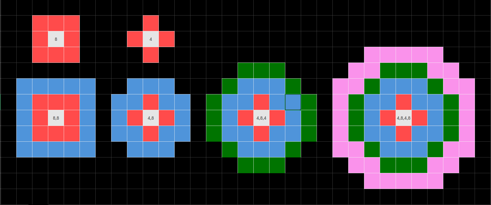

# Thinking Process for Codeforces.

The following is a short draft of my thinking process and planning when doing the questions. Questions are done in the following order. 

If you find any errors or would like to suggest more efficient/better solutions feel free to do a pull request!

# 4A Watermelon (800)

if %2 = 0 --> YES, else NO.

exception: 2 --> NO since 2/2 = 1 odd.

# 71A Strings (800)

.length() > 10 --> too long

input n, for each in n, use .lenght to find. if length <= 12, then we cout word. else:

cout << x[0] + x.length() + x.back()    // note that c++ dont accept x[:-1]

# 1A Theatre Square (1000)

m = lenght, n = breath.

least square l1 for lenght = m/a and round up

least squarte b1 for brteath = n/a and round up

least suqwares = l1 * b1

# 96A Football (900)

string s = 0. for n < size(), if (s[i] == s[i - 1]) , then s++; and if s >= 7, output "YES". and returns 0 (exit program)

default condition is "NO"

# 231A Team (800)

n = number of problems

s = able to b esolved

we create p, v, t. accept inpiut and store thjem into tjheir own array.  then we do for i in range n, if p[i] + v[i] + t[i] >= 1, ++s. loop through until end. 

at first i was thinking given this, then trasnpose 90 degree. split and store into p, v, t own array. then we do for i in range n, if p[i] + v[i] + t[i] >= 1, ++s. loop through until end. but then i realiose you can alrdy seperate the input into 3 since there is alrdy spaces lol.

# 282A Bit++ (800)

x = 0

if in string found `+`, then ++x. else --x. 

use `string::npos` which is a not found indicator. if `+` is not `not found` then it is foi=und. 

# 50A Domino piling (800)

m * n / 2

# 617A Elephant (800)

input n 

x = 0;

if n % 5 != 0, x = n/5 + 1, print x

else print n / 5

# 158A Next Round (800)

n score, kth posiiton. create vector of score x. s is score

for i in range n, compare if x[i] > x[k-1] since k starts from 0. if x[i] > x[k-1], then ++s. ensure x > 0 also. 

# 1999A A + B again? (800)

at first i read the qn wrongly to  some inputs can be non 2 digit like 8 as shown in the example input. i was thinking of like of how to determine the length of the input and was like while n > 9 then run the code until i read closely the first number is the number of inputs later on lmao.

The first idea to solve the problem is to use `.strip()` but i realisedf that c++ dont have.

so use % and / to get remainder and quotient to split since it will always be 2 digits. when you / you get the front digit since it rounds down and when you % you get the remainder which is the back digit. then can add them up and cout it. honestly too troll. 

# 25A IQ Test (1300)

this is an iq test indeed. my firtst 1300 qn but seems fine so far ig. 

My proposed solution is this:
if s % 2 != 0, ++odd, else ++even

if odd > even, 

    if s % 2 != 0: 

         cout s
         ++odd

else if even > odd,

    if s % 2 =- 0:

        cout s
        ++even

but this code outputs the numebr rather thann the index. 

to fix this can use a vector to store the numbers, and use to in range loops. 

remember to +1 to the i since qn says Numbers are numbered from 1 in the input order.

lol im sure there would be a even more efificent and fast way to solve it but i want to eat dinner now, and it kinda works 😝😝

## Optimised solution

Got curious and wanted to find out what's a betetr solution.

the new optimised solution is:

1. start looping from beginning, collecting `odd_count`, `even_count`, `odd_index` and `even_index`. The `odd_index` and `even_index` only updates the fist time each appears. 

2.After reading the first 3 elements, as soon as either `odd_count` or `even_count` hits 2, you know the majority.The other parity is the minority.

3. You continue the loop, but you're not updating the index of the majority anymore. You only wait until the first element of the minority appears (if it hasn’t already), and then update the corresponding index once.

4. From the last 2 if loops we can see that the moment the `odd/even_index` changed, we output the current index, which is the minority. 

This solution has time complexity of `O(n)` and space complexity of `O(1)`. The previous solution is `O(n)` for both. 

# 69A Young Physicist (1000)

takes x, y, z input and store them to x, y, z. 

at the end check if x, y, z are all 0. if yes --> yes, else no

# 466A Cheap Travel (1200)

interesting qn seemed ez at first.

1 stop --> a

m stops --> b

need to take n times

n, m, a, b

lets call no. of times for 1 stop as x
lets call no. of times for m stops as y

whatever permutation of x and m will add up to n. try to take max of m first, then use the remainder for x? 

1. x = n % m. 

2. y = n / m.

sum = y * b + x * a.

hwoeevre the test case 3 suggests that sometimes buyinh buddle may be the cheapest

so we can do for each test case - 1. all single 2. all bubnlde 3. mix. 

for 2 all bundle we can use trick to do ceil(n/m) * b

in int division, n/m is rounded down. so to simulate ceil(n / m) with integers, we do $$ceil(n/m) = {(n+m-1)}/m$$

# 110A Nearly Lucky Number (800)

read input as string, compare character 4 and 7 and others. count no. of 4 and 7. 

total = count4 + count7 

if total == 7 && (count7 != 0 || cout4 != 0), cout YES
else if total == 4 && (count7 != 0 || cout4 != 0), cout YES
else cout NO

# 479A Expression (1000)

since the qn says brute force i will try to list out all possible:

1. a + b*c
2. a*b + c
3. a * (b + c)
4. (a + b) * c
5. a * b * c
6. a + b + c

# 579A Counting Bacteria (1000)

first bitmask qn.

first convert all to binary. notice when they split, it is multiple of 2. So they can only exist as multiple of 2 and number 1. 

e.g. 13 = 8 + 4 + 1 --> 2^3 + 2^2  + 1

notice this is binary system. 

13 = 1101 --> 3 `1`s

So we can just count no. of 1s as the position of the 1s represent the power it is at. 

To do so we just decompose the number into its binary. 

# 339A Helpful Maths (800)

string s. create vector x where all the digits are at. for all character in s, add any non `+` into x, which are the numbers. then sort the numbers. then cout x and +. note this mistake --> dont just cout x, `+`. else will end up with 1+2+3+. so check if current index is size -1 which is last index, if it is wont cout the `+`. 

# 1791C Prepend and Append (800)

My first two pointer qn.

From what i understand, the beginning can be either 0s and 1s or nothing. Then either add 1 to left and 0 to right, or 0 to left and 1 to right, or nothing at all. 

1011011010 --> begin with 1011 left 101 right 010

101010  --> begin with nothing --> left 101 right 010

My approach weill be 

as long as left no. != right number, then ignore. when reach when left no. = right no. then we print length of remaining by doing right - left + 1

# 1851B Parity Sort (800)

very interesting qn, had to search for hints

only able to sort if can exchnage 2 numbers of the same type (odd/even), and sort them to non decreasing. 

one observation of NOs is that there is only one of the type. 

No occurs when you have only one of the type that is not in order. if the one type say number 1 is at the start, then it is possible. 

but how do we determimne if that is the case? maybe can split into 3 parts, sort each part, then compare all? idk

the other observation of NOs is that the position of the lowest is not in front. eg 2 1 6 3 then NO since impssoible to shift.

1. presence of only one no. of a type. if no
2. split into 3 parts --> front

???

another approach is to create a sorted array. then compare the parity to the original. if it matches for all cases --> good. else NO

new approach:

we can have normal array and a sorted array. when we take in the input, we make a copy of it and sort it. then we compare if the sorted array %2 = normal array. because this test checks if its odd or even. if the whole row of odd even mix is exactly same as sorted array, then it is solvable. 

to do so we can build a bool function that returns true if a_sorted % 2 = a, and return false otherwise. Since we are going to duplicate a and sort the duplicate, we need to use pass by reference. 

in the main function we take in the input, then we run the bool function. if bool function return true, then cout Yes else no. we can use ternary operator to do it 

# 1843B Long Long (800)

Another greedy two poiunter qn

this qn is very cursed also i think i need more practise. 

whole row of negative including 0 --> only one action needed

convert all to positive seperate array and compare. 

if + surrounded by - --> change to - first, then change the whole row to + (2 step)

if - surrounded by + --> change to + (1 step)

actually there is a simpler way we can just count no. of contigous negatives.

if number < 0, then start neg segment. so it is when number is negative, and if not in negative segment, then start + counter s. and set neg to true. then it moves on. if it meets positive number, then neg turns false. 

# 118A String Task (1000)

initialise emptyt output r

for every charc in s, tolower() it.

if char a | e | i | o | u : skip

add . 

add charcter

output r

take note in this example y is considered a vowel also lmao

# 230A Dragons (1000)

no. of dragons = n

player initial strength = s

dragon stregnth = x

dragon bonus = y

check if s > any of the x. if no --> NO else:

slayed counter = w

if s > x_n, then ++w, s + y_n. repeat until either w = n or cannot proceed anymore.

we can sort by smallest x? 

we can use pairs for this!

# 1690D Black and White Stripe (1000)

This qn can be solved using fixed size sliding window.

    l of strip of paper = n 

    k consecetuvie black

    t --> no. of tyest case

eg. n=5 k=3, BBWBW. min = BBBBW --> 1 move

eg. n=5 k=1, BBWBW. min = BBWBW  --> 0. 

Idea: most amount of B in a segment --> easier and more direct to find least W in the segment, as we need to change the W. 

size of window = k. from index 0 to index k, count W. save to min_W. then move to the next. we only update min_W when we find the least W. 

we should do a sliding window appraoch as it is faster. --> if the previous was W, --W_count. If the current one is W, then ++W_Count.

first we do index 0 to k. thats the first wibdow. then we do for the rest. this is to avoid having nk runtime. 

# 2126A Only One Digit (800)

find the smallest number in the digits 

convert to string to sort. then take index 0. then convert back to int. 

# 2172A ASCII Art Contest (800)

original thought process:

create list, put 1 in. then see if 2 > or < 1, then add behind/forward. do for 3 also. check if abs(1-2) and abs(2-3) and abs(1-3) < 10. if true then output list[1], else cehck again. 

but then realise we can take input as 3 var, then using min and max find the respective. if max - min >= 10 we know it will definitely be out of bounds --> chcekc again. we can run sort() for this since is only 3 things to sort. 

# 2167B Your Name (800)
n cubes arranged forming string s. 

name is string t, consist of n leters.

q is test case, follwoed by n 

humitsa mitsuha

compare number letters of each side.

while q --, int n, str a, b. split a into n numbers, compare b. 

solutiuon 1: ascii index manipulation: since `a=97`, `b=98`, `c=99`..., we can just subtract whatver our current chracter is with say erxample `a` and it gives the difference, then we can ddeduce. first we create empty array from a to z, then we run for every char in string s, we minus off a. then we run through string t, and we plus. then we see if any remainder. be3cause say eg letter is `abd`, then will be `s: 0, 1, 0, 3`. The index != 0 means have number. then we do for string t. if occur, then we add minus it off. eventually we can check if the end is all 0. if all 0 means total match. 

# 2167A Square? (800)

this qn damn ez

cin t, cin a, b, c, d. if a == b == c == d, then yes, else no

# 2157A Dungeon Equilibrium (800)

min no. of deletion to be balanced.

original idea:

since max numbers is 100 we can maybe still try frequency mappping

c be changes needed. assign frequency = 0. for every occurance we add. then for each in the array say for i in range c+= i-arr[i]. then cout c. 

BUT then realise also it mentions exact mapping x occurance for x so eg x=3 need 3 of 3 else must delete it if less. say only got one 3 then we need to delete that one 3. 

we can use unordered map to store the frequencies. recap of unordered_map cos my brain hazed and died after not doing this for months: when you do unorderedmap<int, int> cnt, it creates nothing at first. then you run for everything inside a the vector we take the number as the first int space. then for the second int we do the ++c[x] which basically means +1 to whicher number it belong. so at first theres nothing. so <,>. if 1 comes up, then it becomes <1,>. then it +1 to that key which is "1" so it adds to <1,1> so now if the next nymber is 1 again, it adds to the so called frequency or the value of the key "1" so now it is <1,2>.

we use underordered map becasue it stores numbners that exists, unlike using a frequency array. but this test case is only 100 so technically wont affect much. 

create UM c where it takes in x from vector n. then it does +=c[x] which is +1 for everytime it the unique key exists. 

let deletions needed d = 0. for every number in map c, we let x be the x and y be the freqwunecy. if freqwuncyt < number, then impossible to hit, then we add the freq of this nmumber into d since we need to dewelte y numbers of this number. else we do freq-number to see how much to cut off. this workjs because if x=y then it will be 0 and nothjing addded to d. 

# 2157B Expansion Plan 2 (900)

Bruh i absoleult havbe no idea how to do this so i am stealingf the solution from ksun48 who seems to be the first to do it. I have no idea how this is 900 i mighjt actually be strupid 

4 -> UDLR (Manhattan distance +1) while 8 --> UDLR+Diagonal (Chebyshev distance +1). 

Insight: each step depends only on the type of expansion, not the specific coordinates of existing black cells.

Manhattan distance: abs(x1-x2) + abs(y1-y2) and Chebyshev distance: max(abs(x1-x2), abs(y-2))

ok so i made a drawing of it to better understand.  

let n4 = number of "4" operations and n8 = number of "8" operations. 

then we take the absolute value of x and y since the problem is symmetric around the origin.

The largest coordinate (either X or Y) is the farthest distance along any axis → Chebyshev distance. 

Each "4" or "8" can move 1 step along one axis at least. So the farthest axis cannot be farther than all your steps combined → max(X,Y) <= n4 + n8. Example: (X,Y) = (5,3), n4=3, n8=2. max(X,Y) = 5. n4+n8 = 3+2 = 5 ✅ reachable. If max(X,Y) > n4+n8 → impossible → "NO"

"4" moves contribute 1 step each → increase Manhattan distance by 1 and "8" moves contribute 2 steps each → because diagonal = moves in both x and y. So the total distance you can cover = n4 + 2*n8. Example: (X,Y) = (3,3), n4=1, n8=2. Total Manhattan distance needed = 3+3 = 6. Maximum distance reachable = 11 + 22 = 5 → cannot reach → "NO".

Essentially  we break it down into x and y coordinate. a 8 will give 2 moves due to diagonals. so youre summing up all the moves in 1 direction and comparing agains the larrgest of trhe given coordinate to estavbluish it reaces the corner. 

Qn so if thats the case wont the n4 + 2*n8 be enbough alrdy, why need conpare (n4 + n8).

Ans: X+Y <= n4 + 2*n8 → total distance reachable → Manhattan distance check

- X+Y <= n4 + 2*n8 → total distance reachable → Manhattan distance check
- max(X,Y) <= n4 + n8 → ensures you can reach the farthest coordinate along one axis → Chebyshev distance check

AKA n4+2\*n8 is the x/y only, while n4+n8 is the diagonal. sometimes diagonal satisfied, but xy is not. Example: (X,Y) = (5,0) and n4 = 0, n8 = 3. so for horizontal/vertical --> 0+3=3 (not enough), but if do diagonal 0+2\*3=6 (seemingly enough). So we need check both. 

# 2356A Pizza Time (800)

n pizza. if <= 2 then alex. 

if not --> m whewre m>=3 and m1+m2+m3=m and 1<=m1<=m2<=m3.

Hao eats m1 and alex eats m2. then m3 is carried over to next day. split so hao eat the most. strat is to let m1m2m3 to be as near as possible and if multiple of 3, then we set them to be all the same. 

now i am thinking if the strat is to keep m1 and m2 the same. but will it be better tho. see if m=8 and m1=2, m2=2, m3=4 --> Hao (2), carry over next day is 4 --> new m1=1, new m2=1, new m3=2, total is still 3. Compared to case study of m1=2, m2=3, m3=3 then new day m1=1, m2=1, m3=1 so total still 3. 

so we can test it by running for eg m=10. so we get 

    1. Case 1
        - 3 3 4
        - 1 1 2
    total 4

    2. Case 2
        - 1 1 8
        - 1 1 6
        - 1 1 4
        - 1 1 2
    total also 4

so we have established that it doesnt matter. 

so we can maybe do / and % to get the base and remainder. 